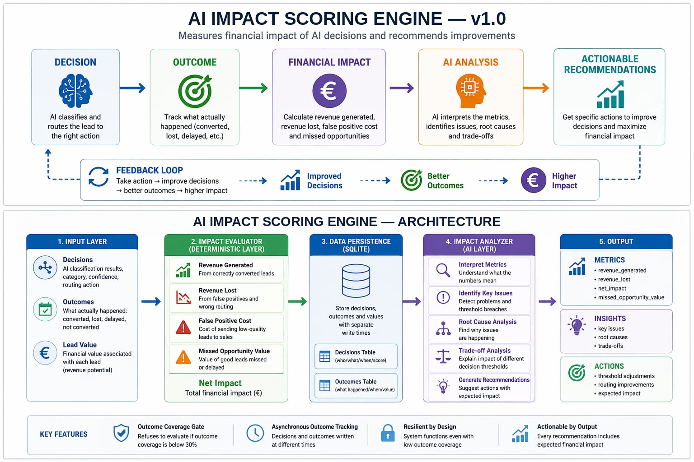
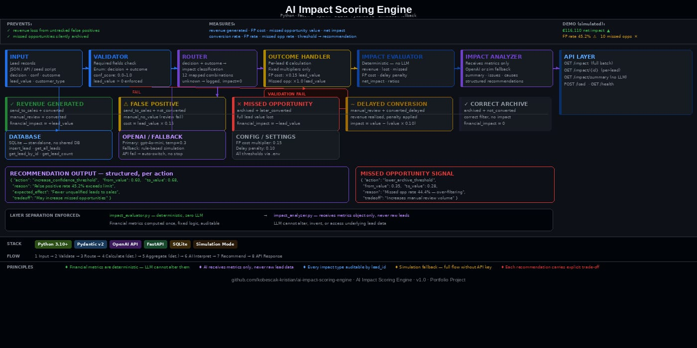

# AI Impact Scoring Engine — v1.0

Most AI systems make decisions.

Very few know if those decisions were actually correct.

Even fewer measure what those decisions actually cost.

This system measures the financial impact of AI lead routing decisions and recommends how to improve them.

**System design | AI evaluation pipeline | FastAPI + Python**

---



---

## The Problem

AI systems route leads (send to sales, archive, manual review), but almost no system measures the **financial consequence of those decisions**.

As a result:

- False positives waste sales effort
- Missed opportunities lose revenue silently
- No feedback loop exists to improve decision thresholds

**Who has this problem:**

- Revenue operations teams
- AI automation builders
- Sales ops managing lead qualification pipelines

---

## Why This Matters

Most AI systems optimise accuracy.

This system optimises **business impact**.

It shows:

- What decisions generated revenue
- What decisions lost money
- Where thresholds are misaligned
- What to change to improve outcomes

---

## What This System Does

This system acts as a **decision intelligence layer** on top of an existing AI pipeline.

It connects:

**Decision → Outcome → Financial Impact → Recommendation**

It does NOT make business decisions.

It evaluates them and translates them into measurable financial consequences.

---

## Outcome (Simulated)

- 75 leads processed
- Revenue generated: €165,170
- Revenue lost: €49,060
- Net impact: €116,110
- Conversion rate: 41.3%
- False positive rate: 45.2%
- Missed opportunity rate: 44.4%
- 4 structured recommendations generated

**Note:** Dataset intentionally constructed to produce both positive and negative outcomes for evaluation demonstration.

---

## Architecture



---

## How It Works

Pipeline:

1. Input validation
2. Impact classification (maps decision + outcome → financial category)
3. Per-lead financial calculation
4. Aggregate metrics computation (deterministic — no LLM)
5. AI interpretation (receives metrics only, never raw lead data)
6. Recommendation generation
7. API response

---

## Layer Separation

Financial metrics are computed with fixed logic before the AI layer runs.

The AI layer receives only the final metrics object — it cannot alter, invent, or access underlying lead data.

- `impact_evaluator.py` — deterministic, zero LLM
- `impact_analyzer.py` — interprets metrics only, never raw leads

---

## Business Value

- Makes hidden revenue loss visible
- Quantifies cost of wrong AI decisions
- Enables threshold optimisation
- Reduces reliance on manual analysis
- Creates a continuous improvement loop

---

## Example

### Input

```json
{
  "decision": "archived",
  "confidence_score": 0.38,
  "outcome": "later_converted",
  "lead_value": 5500
}
```

### Output

```json
{
  "impact_type": "missed_opportunity",
  "financial_impact": -5500,
  "notes": "Missed opportunity — lead was archived but later converted elsewhere"
}
```

### Recommendation

```json
{
  "action": "lower_archive_threshold",
  "from_value": 0.35,
  "to_value": 0.28,
  "reason": "Missed opportunity rate of 44.4% indicates over-filtering",
  "expected_effect": "More borderline leads routed to manual review rather than archived",
  "tradeoff": "Increases manual review volume and associated review costs"
}
```

---

## Quick Start

```bash
# 1. Clone the repo
git clone https://github.com/kobescak-kristian/ai-impact-scoring-engine

# 2. Create and activate virtual environment (Python 3.12 recommended)
# Windows:
py -3.12 -m venv venv
venv\Scripts\activate
# macOS/Linux:
# python3.12 -m venv venv && source venv/bin/activate

# 3. Install dependencies
pip install -r requirements.txt

# 4. Run demo (no API key required — simulation mode active by default)
python seed_and_run.py
```

To run the live API:

```bash
python main.py
```

Then open: `http://localhost:8000/docs`

---

## API Endpoints

| Method | Endpoint | Description |
|--------|----------|-------------|
| GET | `/impact` | Full batch analysis — metrics + AI interpretation + recommendations |
| GET | `/impact/summary` | Deterministic metrics only — no LLM call |
| GET | `/impact/{lead_id}` | Per-lead financial impact detail |
| POST | `/load` | Load lead records into the database |
| GET | `/health` | Health check |

### `/load` — example request body

```json
[
  {
    "lead_id": "L001",
    "decision": "send_to_sales",
    "confidence_score": 0.87,
    "outcome": "converted",
    "lead_value": 4200,
    "customer_type": "enterprise",
    "value_tier": "high",
    "source": "inbound",
    "timestamp": "2024-01-03T09:15:00"
  }
]
```

Valid `decision` values: `send_to_sales`, `archived`, `manual_review`

Valid `outcome` values: `converted`, `not_converted`, `later_converted`, `converted_delayed`, `pending`

`pending` leads are accepted and stored, but excluded from all financial calculations until an outcome is recorded.

Optional fields: `customer_type` (`enterprise`, `smb`, `individual`), `value_tier` (`high`, `medium`, `low`), `source`, `timestamp`

---

## Stack

- Python 3.12
- FastAPI
- OpenAI API (gpt-4o-mini)
- SQLite
- Pydantic v2
- Simulation fallback (full flow without API key)

---

## Known Limitations

### Financial multipliers are not calibrated from real data

False positive cost (15% of lead value) and delay penalty (10%) are fixed constants defined in `config/settings.py`. All financial output, including the net impact figure, is calculated against these assumed values. In production these would need to be derived from actual sales cycle costs per customer segment.

### Outcome data reliability

The `later_converted` and `converted_delayed` outcome types require a feedback loop that does not exist in this system. In production, outcome data is partial, delayed, and often absent. The missed opportunity value — the largest loss figure in the demo — is therefore the least reliable metric.

### Recommendations are not anchored to current system state

The impact analyzer recommends threshold changes (e.g. increase from 0.60 to 0.68) without knowing what the actual upstream threshold is set to. In simulation mode, the `from_value` in recommendations is an illustrative default, not read from system config.

### No coverage gate

The evaluator runs full analysis regardless of how many leads have outcomes recorded. A system with 10% outcome coverage will produce the same confident-looking output as one with 90% coverage. A coverage gate returning `insufficient_data` below a defined threshold is not implemented in v1.

### Not production-ready

- No authentication on API endpoints
- SQLite is not suitable for concurrent writes at scale
- No date range filtering on `/impact` — runs over full dataset
- Dataset is simulated and intentionally constructed to demonstrate both strong and weak decision performance

---

## Status

Complete — v1.0

---

## System Context

Part of a five-engine AI decision system:

- **[AI Reliability Engine](https://github.com/kobescak-kristian/ai-reliability-engine)** - prevents invalid AI outputs from entering workflows
- **[AI Decision Engine](https://github.com/kobescak-kristian/ai-decision-engine)** - tracks outcomes and evaluates whether decisions were correct
- **AI Impact Scoring Engine** - measures the financial impact of decisions and tunes thresholds *(this system)*
- **[AI Context Engine](https://github.com/kobescak-kristian/ai-context-engine)** - grounds decisions in retrieved precedent and explains them
- **[AI Execution Engine](https://github.com/kobescak-kristian/ai-execution-engine)** - executes the workflow and recommends improvements

Complete system: validation → evaluation → financial impact → grounded explanation → execution